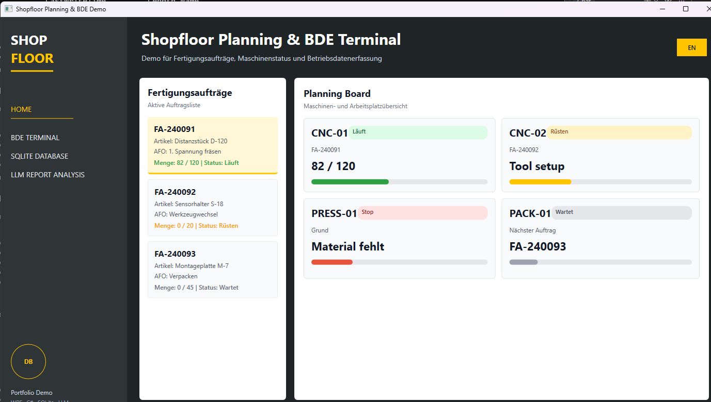
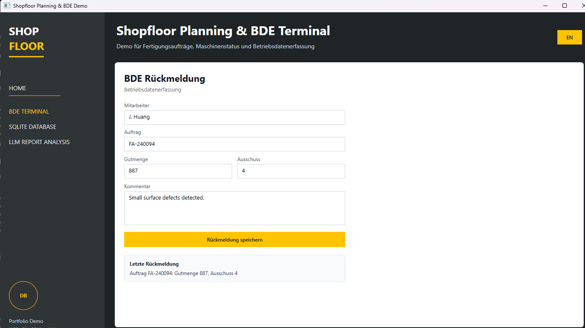
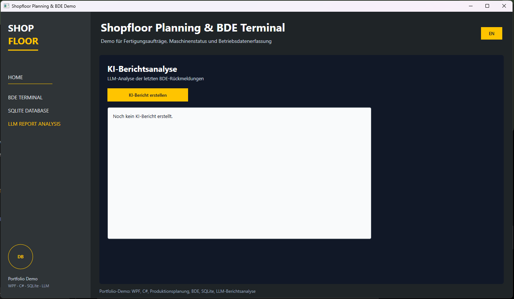

# Shopfloor Planning & BDE Demo

A Windows desktop demo for industrial shopfloor data collection, manufacturing order tracking, SQLite persistence and LLM-based production reporting.

The project is built with **C#**, **WPF**, **.NET 10**, **SQLite** and an optional **OpenAI-compatible LLM API** integration.

This is a portfolio project for industrial software scenarios such as BDE/Betriebsdatenerfassung, shopfloor terminals and production reporting.

## Screenshots

### Home / Planning Board



### BDE Terminal



### LLM Report Analysis



## Features

- Industrial-style WPF desktop UI
- Manufacturing order overview
- Machine and workstation status board
- BDE feedback entry for order, good quantity, scrap and comments
- Local SQLite database persistence
- Feedback history view
- German / English UI switch
- LLM-based production report analysis
- API key loaded from an environment variable, not stored in source code

## Tech Stack

- C#
- WPF
- .NET 10 for Windows
- SQLite
- Microsoft.Data.Sqlite
- OpenAI Responses API via `HttpClient`

## Requirements

- Windows 10 or Windows 11
- Visual Studio 2022 or newer
- .NET 10 SDK
- Visual Studio workload: **.NET desktop development**

The normal shopfloor and database features run without an API key. The LLM report feature requires an API key.

## Run The Application

1. Clone or download this repository.
2. Open `ShopfloorPlanningBdeDemo.csproj` in Visual Studio.
3. Restore NuGet packages if Visual Studio asks for it.
4. Press the green **Start** button.

You can also run it from PowerShell:

```powershell
cd C:\path\to\ShopfloorPlanningBdeDemo
dotnet run
```

## Configure The LLM API Key

The AI report feature reads the API key from the Windows environment variable `OPENAI_API_KEY`.

Set it in PowerShell:

```powershell
setx OPENAI_API_KEY "your-api-key"
```

After setting the variable, close and reopen Visual Studio before running the app again.

To check whether the key is available:

```powershell
if ($env:OPENAI_API_KEY) { "API key is set" } else { "API key is missing" }
```

Do not commit API keys to GitHub.

## Database

The application creates a local SQLite database automatically at runtime:

```text
bin\Debug\net10.0-windows\shopfloor_bde.db
```

The database file is intentionally ignored by Git because it is runtime data. Every user can generate their own local database by saving BDE feedback in the app.

## Main Workflow

1. Open the app.
2. Go to **BDE Terminal**.
3. Enter production feedback such as order number, good quantity, scrap and comment.
4. Save the feedback.
5. Go to **SQLite Database** to see the persisted history.
6. Go to **LLM Report Analysis** and generate a report if an API key is configured.

## Portfolio Focus

This demo shows how a desktop application can combine:

- a shopfloor-oriented user interface,
- local production data capture,
- database persistence,
- bilingual UI handling,
- and LLM-based reporting on structured production feedback.

The LLM is used as an additional reporting layer. The production data remains structured in SQLite, while the model generates a short human-readable analysis from recent BDE records.

## Notes

- The UI is inspired by common industrial terminal patterns, but it does not use any third-party company logo or proprietary design assets.
- The sample orders and machine states are demo data.
- The application is intended as a portfolio project, not as production MES software.
